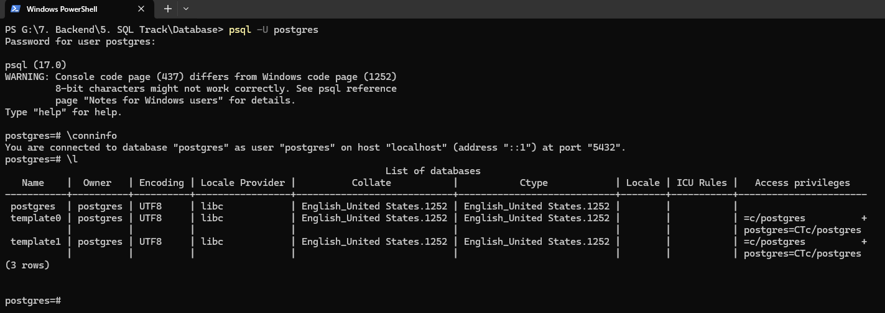

**4 Feb, 25**

## 50-1 Solving The First Case Study

### Case Study

A Medical Database System is needed to enhance the efficiency and effectiveness of healthcare services. This system will be able to seamlessly integrates the information of patients, doctors, appointments, medical records, and medical facilities.

**Entities:**

1. **Patients:**
   - Attributes: PatientID (Primary Key), FirstName, LastName, DateOfBirth, Gender, ContactNumber, Email
2. **Doctors:**
   - Attributes: DoctorID (Primary Key), FirstName, LastName, Specialization, ContactNumber, Email
3. **Appointments:**
   - Attributes: AppointmentID (Primary Key), PatientID (Foreign Key), DoctorID (Foreign Key), AppointmentDate, AppointmentTime, Status
4. **Medical Records:**
   - Attributes: RecordID (Primary Key), AppointmentID (Foreign Key), Diagnosis, Prescription, TestResults, createdAt
5. **Medical Facilities:**
   - Attributes: FacilityID (Primary Key), FacilityName, Location, ContactNumber

**Relationships:**

- Patients can have multiple appointments with different doctors.
- Doctors can have multiple appointments with different patients.
- Each appointment may have a corresponding medical record, and vice versa.
- A medical facility can have multiple doctors, and a doctor can work in multiple medical facilities. This relationship is represented through a junction table.

### Top-down Design Approach

1. find out core requirements
2. find out the entity
3. find out the attributes
4. find out the relationships

### Case study solution:

- doctor and medical facility --> many to many (creating relationship using another table)
- appointment and medical record --> one to one
- patient and appointment --> one to many
- doctor and appointment --> one to many
- so doctor and patient --> many to many (solving/merging using appointment table)

**10 Feb, 25**

## 50-2 Exploring PSQL and its Default Behavior, Creating Database

- psql shell
  
  

- to use windows shell, environment variable has to be fixed
- Steps:
  - windows button --> env --> go to 'Edit the system environment variable --> environment variable --> system variable --> new --> copy path ( go to c drive --> go to program files --> go to postgreSQL --> go to 17 --> go to bin and copy the path)
  - `C:\Program Files\PostgreSQL\17\bin`

- commands:
  - psql -U user_name
  - psql -U user_name -D database_name
    
    
    

**11 Feb, 25**

- google search: create database postgres with all options
- commands:
  - create database test_db2 with template template0

## 50-3 User, Role and Privilege Management in POSTGRES.

- commands:
  - \dn (to see if there is a schema within the database)
    
  - \! cls (to clear)
  - \du (to see my username)
    
    **12 Feb, 25**
  - create user user1 with login encrypted password '123454'
  - \du
  - create role role1 with login encrypted password '123454'
  - \du
  - create table test_table (name varchar(50))
  - \d
  - insert into test_table(name) values('vutu vai');
  - select \* from test_table;

**11 Feb, 25 & 24 Feb, 25**

## 50-4 Granting and Revoking Privileges

- commands:
  - \conninfo
  - psql -U user1 -D postgres `(creating user)`
  - select \* from test_table `(to see the new user)`
  - grant all privileges on table test_table to user1; `(giving all permission - read, write etc to user1 of table test_table)` -- output will be `GRANT`
  - select \* from test_table;
  - create user user2 with encrypted password '123456'
  - NEW TAB: psql -u user2 -- postgres and password `(access as user2)`
  - insert into test_table(name) values('putu vai');
  - select \* from test_table;
  - create user user2 with login encrypted password '123454'
  - select \* from test_table;
  - grant select on table test_table to user2; `(giving only view permission to the new user, data insertion permission is not giving to user2)`
  - insert into test_table(name) values('putu vai'); -- `test if we can insert` -- output will be `permission denied`
  - select \* from test_table;
  - revoke select on table test_table from user2; -- `taking back all granted permissions`
  - insert into test_table(name) values('putu vai'); -- `test if we can insert` -- output will be `permission denied`
  - grant all privileges on all tables; -- `granting permission to all table`
  - grant all privileges on all tables to user2; -- `granting permission to all table to user2` -- not good practice
  - grant all privileges on all tables in schema public to user2; -- `giving permission to public`
  - select \* from test_table;
  - \!cls -- `clear console`
  - insert into test_table(name) values('putu vai'); -- `test if we can insert` -- output will be `permission denied`
  - grant select on all tables in schema public to role1; -- `grant permission to role1 to read any table` -- output `GRANT`
  - create user user3 with encrypted password '123456' -- OUTPUT `CREATE ROLE`
  - grant role1 to user3 -- OUTPUT `all permission of role1 will be moved to user3`

**24 Feb, 25**

## 50-5 Structured Query Language (SQL)

- SQL is a declarative language
- language 2 types : declarative (only have to mention what to work) & imperative (have to mention what and how to work)
- types of SQL commands:

  - DDL(data definition language) (CREATE, DROP, ALTER, TRUNCATE)
  - DML(data manipulation language) (INSERT, UPDATE, DELETE)
  - DCL(data control language) (GRANT, REVOKE)
  - TCL(transaction control language) (COMMIT, ROLLBACK, SAVEPOINT)
  - DQL (SELECT)

- client --> (web app, desktop app, mobile app) --> SQL --> postgres/MySQL/Oracle(database Management system - a server) --> databases(db1, db2, db3)
