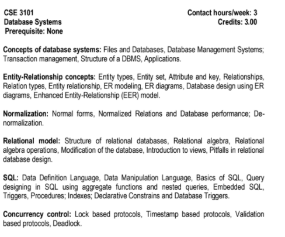

**9 Oct, 24**

# 48-0 Welcome

- AWS, Docker, cse pipeline (rewards)

# 48-1 Understanding Data, Information and Database

- **DBMS (Database Management System)** & **POSTGRESQL**

- **POSTGRESQL** : a popular RDBMS

- **What is Database?** : a database is a structured collection of related data that represents some real world entities and are organized for efficient retrieval, storage, and management

- **What is Database?** : a computer -- contains a hard drive

- dram memory

- **what is data?** : data are facts that can be recorded

- **what is information?** : information is processed and organized data that provides meaningful context , insight or knowledge

- raw data --> process --> information

# 48-2 What is DBMS and Why

- a piece of software to manage database

- **draw back storing data using file system** :

1. unstructured data, multiple file format (.txt, .mp4, etc)
2. data redundancy
3. data inconsistency
4. no concurrency protocol
5. access complication
6. security issue

- file --> DBMS (a software) --> database
- SQL (structured query language) --> DBMS (a software) --> database

- **Popular DBMS** :

1. relational: MySQL, PostGRESQL, SQLite, Microsoft SQL Server etc are RDBMS
2. document: MongoDB, amazon dynamo etc are non-relation or NoSQL DBMS
3. kye value: redis

# 48-3 Different types of Database Model and Relational Model

- **Different types Database Model** :

1. Hierarchical
2. Network
3. Relational
4. Document
5. Key value

**12 Oct, 24**

# 48-4 Anatomy of a Table/Relation

**keywords/Terminologies**:

- column/ attribute
- constraint / domain
- degree -- all column at a time in a table (collection of column)
- row/tuples/records
- cardinality -- all row in a table

# 48-5 What is Key and Super Key

- **Key**: a key in a relational database is a field or a combination of fields that uniquely identifies a record in a table.
- super key, primary key, candidate key, alternate key, composite key, foreign key

- **super key**:

1. attribute or set of attribute by which we can identify each row uniquely
2. it could be a single attribute or a set of attribute
3. it could have null values in the set
4. it is actually a superset

# 48-6 Candidate, Primary, Alternate and Composite Key

- **candidate key**:

1. super key whose proper subset is not a super key
2. also called **Minimal Super key** whose cannot be broken more
3. **Potential primary key** : from the candidate keys, one is chosen as the primary key. However, all candidate keys are potential choices for the primary key.

- **primary key** :

1. from the candidate keys, one key is chosen as the primary key for the table. the primary key is a specific candidate key that is selected as the main identifier for the records in that table.
2. should be unique, not null and stable

- **alternate key**:

1. candidate keys which were not chosen as primary key

- **composite key**:

1. candidate keys which were not chosen as primary key

**example**:

- super key: {u_id}, {u_id, name}, {u_id, email}, {u_id, name, email, gender, age}, {name, email}, {name, gender}, ..., etc
- candidate key: {u_id}, {name, gender}
- primary key: {u_id}
- alternate key: {name, gender}
- composite key: {name, gender}

# 48-7 Explaining Foreign Keys

- **foreign key**:

1. primary key of another table

- **referential integrity** --> create a constraint --> we can only use the primary keys as foreign keys that are actually used as primary key in a table

# 48-8 Techniques to Design Database

- **software development life cycle (SDLC)**: planning (what, why, how we will make) --> analysis (requirement analysis, time or deadline analysis) --> system design (database design) --> building (practical task) --> testing (expected product or not) --> deployment

- **purpose of database design** : structured organization for efficient data management and retrieval for a **robust** system

- **techniques to design database**:

1. top-down
2. bottom-up
3. hybrid approaches (mixed of top-down and bottom-up)

# 48-9 Steps of Top-down Technique

- **Entity-Relationship (ER) diagram**: an entity-relationship (ER) diagram is a visual representation used in database design to illustrate the relationships between entities. it shows how different entities in a database relate to each other through various types of relationships like ont-to-one, one-to-many, or many-to-many

- **top-down steps**:

1. determining entities
2. determining attributes for each entity
3. relationships among entities

- **characteristics of entity**: for determining entities

1. entity will be place, or person, or thing
2. it must have properties or attributes
3. it must have an unique identifier
4. must have a singular name (its a conventions actually)
5. it should contain more than one instance of data

- **characteristics of attributes**: for determining attributes of an entity

1. should be related to the entity
2. should be atomic
3. should have keys

# 48-10 Relationship and Relationship Cardinality

- **Relationships among entities** : also called **relationship cardinality**
- **relationships** : connection between entity or tables
- **relationship cardinality**: it refers in databases specifies how many instances of one entity are associated with how many instances of another entity.

- **types of relationship cardinality**:

1. **one-to-one (1:1)** : a person has one passport and a passport belongs to only one person
2. **one-to-many (1:N)**: a university department has multiple students, but each student belongs to only one department.
3. **many-to-one (N:1)**: many employees work for one company, but each employee works for only one company
4. **many-to-many (N:N)**: students enroll in multiple courses and each course has multiple enrolled students.
5. **optional one-to-one (0..1 : 0..1)** : a person mey or may not have a driver's license, and a driver's license may or may not be associated with a person.
6. **optional one-to-many (0..1 : N)** : a department may or may not have employees but an employee must belong to a department.

# 48-11 Tooling for Er Diagram And Creating First Er Diagram

- **er diagram draw tools**: (https://www.google.com/search?q=er+diagram+draw+tools&oq=er+diagram+draw+tools+&gs_lcrp=EgZjaHJvbWUyBggAEEUYOTIICAEQABgHGB4yCAgCEAAYCBgeMggIAxAAGAgYHjIICAQQABgIGB4yDQgFEAAYhgMYgAQYigUyDQgGEAAYhgMYgAQYigUyDQgHEAAYhgMYgAQYigUyDQgIEAAYhgMYgAQYigUyCggJEAAYgAQYogTSAQkxNTM2NmowajeoAgCwAgA&sourceid=chrome&ie=UTF-8)
- **Draw.io (ER diagram drawing tool)** : (https://app.diagrams.net/)
- **Lucidchart (ER diagram drawing tool)**:(https://lucid.app/lucidchart/c7217a11-ba8c-4ce9-acb6-f17de3034fc7/edit?page=0_0&invitationId=inv_3ff20e46-14f8-4a0a-911d-86f825c0ff22#)

- **Case Study**: (https://lily-plate-b6a.notion.site/Case-Study-082bcd700e034e0b85a54bf82ba590ab)

# Module 49

# 49-1 Understanding Anomalies

- **Anomalies** : anomalies in databases refer to inconsistencies or unexpected issues that can occur during data manipulation or retrieval

- **Types of Anomalies**:

1. update anomalies
2. delete anomalies
3. insert anomalies

# 49-2 Understanding Functional Dependency.

- **Normalization** :

1. **Functional Dependency**: Functional Dependency in simple terms means that the value of one attribute (or set of attributes) uniquely determines the value of another attribute(s)
   uniquely determines the value of another attribute(s) in a database table.

2. **Normal Forms**:

# 49-3 Normalization and 1st Normal Forms (1NF) -- watch again

- **Normal Forms**: a series of guidelines that help to ensure that the design of a database is efficient , organized and free from data anomalies.

1. **0NF** : totally not organized data
2. **1NF rules**:
   - atomic values
   - unique column names
   - positional Dependency
   - column should contain data that are of the same type
   - determine primary key

# 49-4 2nd Normal Forms and Partial Dependency (2NF). (watch again)

3. **2NF rules**:
   - must be in 1NF
   - must not contain any non-prime/non-key attribute that is functionally dependent
     on a proper subset of any candidate key of the relation.
   - **Partial Dependency**

- **lossy decomposition**: loss one important attribute because of splitting table
- **lossless decomposition**

# 49-5 3rd Normal Forms and Transitive Dependency (3NF) (watch again)

4. **3NF rules**:
   - Must be in 2NF
   - must not contain **transitive dependency**

- **transitive dependency**: if x depends on y, and y depends on z, then x depends on z.

# 49-6 Resolving Many to Many with Junction Table. (watch again)

- **Junction Table** : intermediate table

# 49-7 Completing The ER Diagram (watch again)

# 49-8 What is Postgres and Installing Postgres

- the world's most advanced open source relational database management system
- **why do we learn postgres?** :

  1. open source (world's experienced developer's fixing its bug, adding robust
     feature, giving support)
  2. RDBMS
  3. Modern
  4. ACID compliance
  5. advanced data types
  6. scalability
  7. indexing
  8. community support

- **PostGRESQL**: (https://www.postgresql.org/)

# 49-9 Exploring Data Flow in an Application and Exploring PSQL (watch again)

- **client server architecture**:
  client <--> server (localhost:3000) <--> DBMS(database management server (host=localhost, port=5432, in this case postgresql)) <--> databases
- password : 123456

**post shell commands:**

- select version();
- **\l** : to see all databases
- **\c template1** : connect to database
- **\c postgres** : connect to database
- **create table test_table(name varchar(50));**
- **\dn** : how to see schema
- **\! cls** : to clear shell
- **\d**:
- **\d+**:
- **\dt**:
- **\conninfo**: connection information

# 49-10 Module Summery and Practice Case Study
